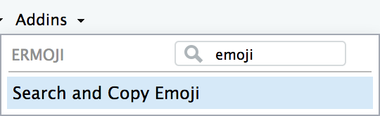
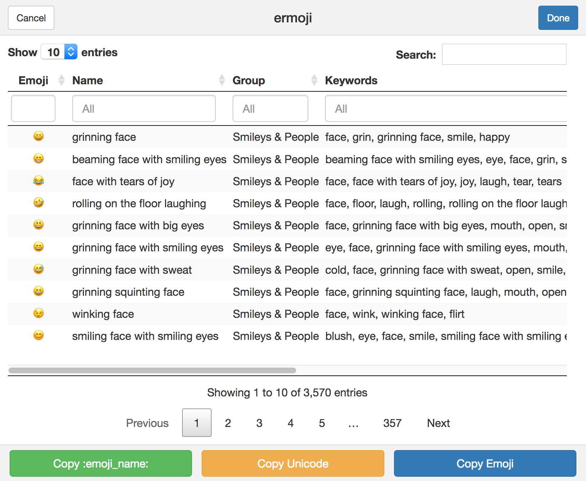
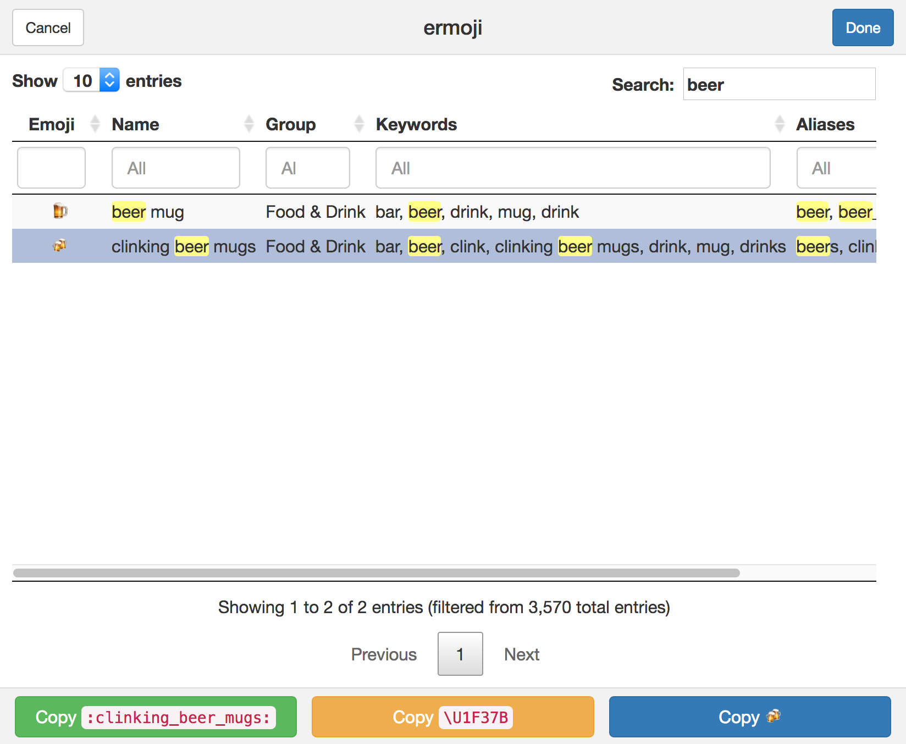
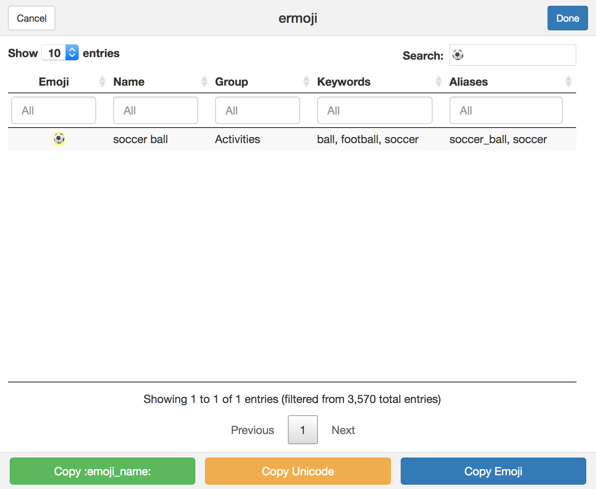
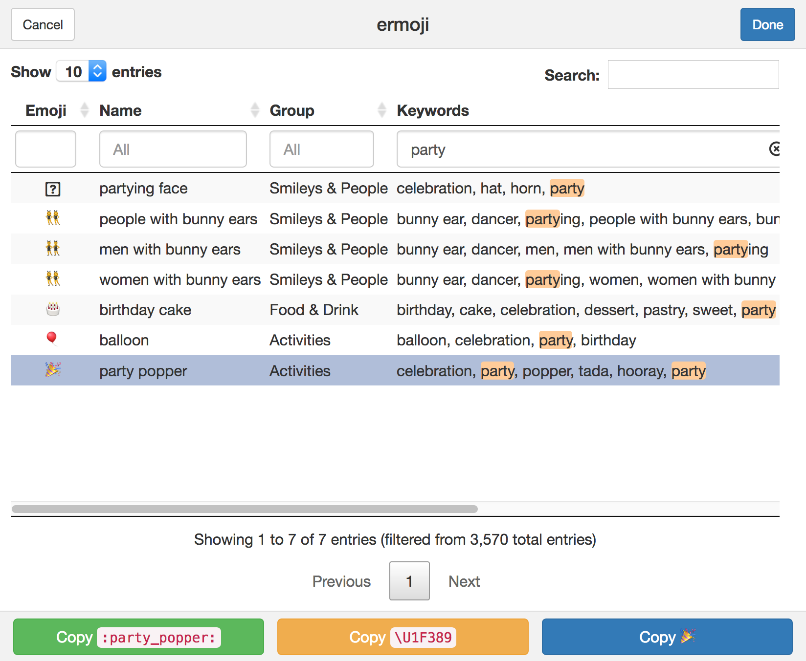

<!-- README.md is generated from README.Rmd. Please edit that file -->

# ermoji

Search, find and copy emojis inside RStudio. Basically a
[DT](https://rstudio.github.io/DT) +
[clipr](https://github.com/mdlincoln/clipr) +
[miniUI](http://shiny.rstudio.com/articles/gadget-ui.html) wrapper
around [hadley/emo](https://github.com/hadley/emo).

**Why?** Because 🤓. But also because I wanted an easy way to find the
Unicode strings for emoji.

## Installation

Install **ermoji** with [devtools](https://github.com/r-lib/devtools)

``` r
devtools::install_github("gadenbuie/ermoji")
```

Or install using Dean Attali’s
[addinlist](https://github.com/daattali/addinslist).

## Usage

Open *Search and Copy Emoji* from the RStudio Addins dropdown.



Pick your emoji and use the “Copy” buttons to copy the emoji to your
clipboard.

### Browse the Emoji List



### Search for Emoji

You can use regular expressions to search for any text in the table of
emoji.



### Search *by Emoji*

You can even search *by emoji* by pasting your emoji into the search
field.



### Search in Specific Columns

Search inside individual columns for more specific emoji
finding.



-----

**ermoji** was built by [Garrick
Aden-Buie](https://www.garrickadenbuie.com)
([@grrrck](https://twitter.com/grrrck)).

Built on the shoulders of giants. Thanks to Hadley Wickham for
[emo](https://github.com/hadley/emo), Yihui Xie and RStudio for
[DT](https://rstudio.github.io/DT), Matthew Lincoln for
[clipr](https://github.com/mdlincoln/clipr). Thanks to
[r-lib](https://github.com/r-lib) for `devtools` and `usethis` — from
idea to package in 60 minutes.

Find more great RStudio addins on the
[addinlist](https://github.com/daattali/addinslist), like my other addin
[regexplain](https://github.com/gadenbuie/regexplain).

Feel free to [file an issue](https://github.com/gadenbuie/ermoji/issues)
if you find a bug – or better yet, submit a pull request\!
